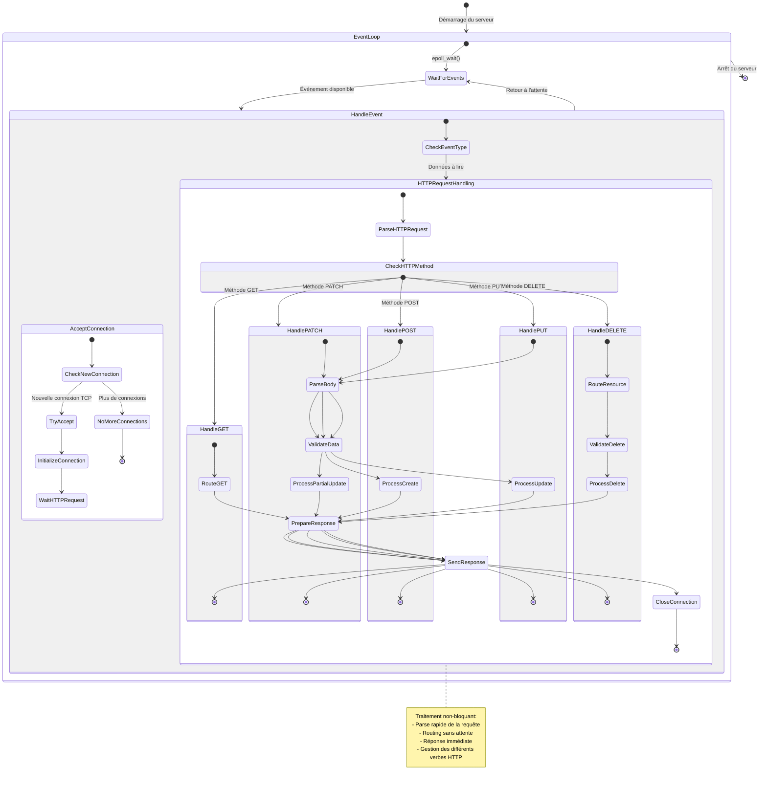

# Localhost

```mermaid
stateDiagram-v2
    [*] --> EventLoop : Démarrage du serveur

    state EventLoop {
        [*] --> WaitForEvents : epoll_wait()
        
        WaitForEvents --> HandleEvent : Événement disponible
        
        state HandleEvent {
            [*] --> CheckEventType
            
            state AcceptConnection {
                [*] --> CheckNewConnection
                CheckNewConnection --> TryAccept : Nouvelle connexion TCP
                CheckNewConnection --> NoMoreConnections : Plus de connexions
                
                TryAccept --> InitializeConnection
                InitializeConnection --> WaitHTTPRequest
                
                NoMoreConnections --> [*]
            }
            
            state HTTPRequestHandling {
                [*] --> ParseHTTPRequest
                
                ParseHTTPRequest --> CheckHTTPMethod
                
                state CheckHTTPMethod {
                    [*] --> HandleGET : Méthode GET
                    [*] --> HandlePOST : Méthode POST
                    [*] --> HandlePUT : Méthode PUT
                    [*] --> HandleDELETE : Méthode DELETE
                    [*] --> HandlePATCH : Méthode PATCH
                }
                
                state HandleGET {
                    [*] --> RouteGET
                    RouteGET --> PrepareResponse
                    PrepareResponse --> SendResponse
                    SendResponse --> [*]
                }
                
                state HandlePOST {
                    [*] --> ParseBody
                    ParseBody --> ValidateData
                    ValidateData --> ProcessCreate
                    ProcessCreate --> PrepareResponse
                    PrepareResponse --> SendResponse
                    SendResponse --> [*]
                }
                
                state HandlePUT {
                    [*] --> ParseBody
                    ParseBody --> ValidateData
                    ValidateData --> ProcessUpdate
                    ProcessUpdate --> PrepareResponse
                    PrepareResponse --> SendResponse
                    SendResponse --> [*]
                }
                
                state HandleDELETE {
                    [*] --> RouteResource
                    RouteResource --> ValidateDelete
                    ValidateDelete --> ProcessDelete
                    ProcessDelete --> PrepareResponse
                    PrepareResponse --> SendResponse
                    SendResponse --> [*]
                }
                
                state HandlePATCH {
                    [*] --> ParseBody
                    ParseBody --> ValidateData
                    ValidateData --> ProcessPartialUpdate
                    ProcessPartialUpdate --> PrepareResponse
                    PrepareResponse --> SendResponse
                    SendResponse --> [*]
                }
                
                SendResponse --> CloseConnection
                CloseConnection --> [*]
            }
            
            CheckEventType --> HTTPRequestHandling : Données à lire
        }
        
        HandleEvent --> WaitForEvents : Retour à l'attente
    }
    
    EventLoop --> [*] : Arrêt du serveur

    note right of HTTPRequestHandling
        Traitement non-bloquant:
        - Parse rapide de la requête
        - Routing sans attente
        - Réponse immédiate
        - Gestion des différents verbes HTTP
    end note
```