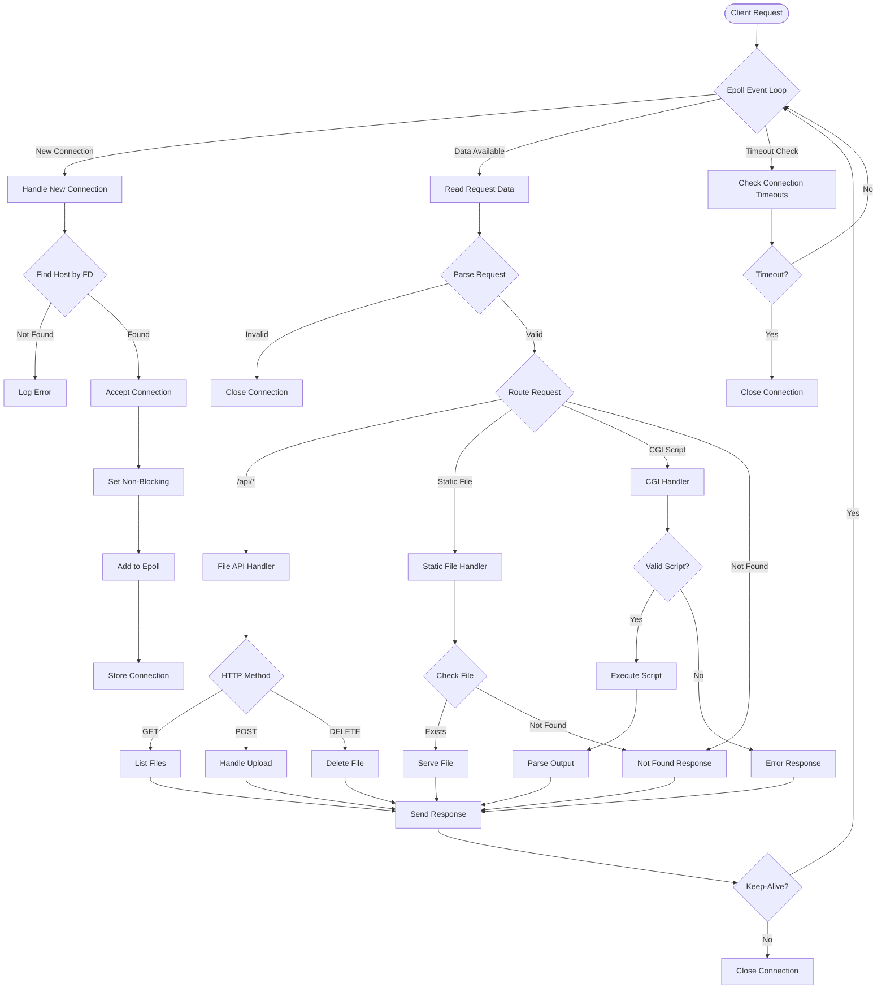

# Localhost

# 🚀 Serveur Web Modulaire en Rust

Bienvenue dans ce projet de serveur web moderne et performant écrit en Rust ! Ce serveur a été conçu pour être modulaire, efficace et facile à étendre.

## 📑 Table des matières

- [Architecture](#architecture)
- [Fonctionnalités](#fonctionnalités)
- [Composants principaux](#composants-principaux)
- [Flux de fonctionnement](#flux-de-fonctionnement)
- [Configuration](#configuration)
- [Utilisation](#utilisation)
- [Contribuer](#contribuer)

## 🏗 Architecture

Le serveur est construit autour d'une architecture événementielle utilisant epoll, permettant une excellente performance même sous forte charge. Voici le diagramme de flux principal :



## ✨ Fonctionnalités

- **Virtual Hosting** : Support de plusieurs domaines sur un même serveur
- **Gestion de fichiers statiques** : Serveur de fichiers optimisé
- **Support CGI** : Exécution de scripts dynamiques
- **API de gestion de fichiers** : Upload, listing et suppression via REST API
- **Keep-Alive** : Connexions persistantes pour de meilleures performances
- **Logging intégré** : Suivi détaillé des opérations
- **Gestion des timeouts** : Protection contre les connexions zombies

## 🧩 Composants principaux

### Server
Le cœur du système qui :
- Gère la boucle epoll principale
- Maintient les connexions actives
- Dispatche les événements aux bons handlers
- Assure la surveillance des timeouts

### Host
Gère la configuration des hôtes virtuels avec :
- Support multi-ports
- Configuration des routes
- Gestion des listeners

### Connection
Gère les connexions individuelles :
- Buffer de lecture optimisé
- Parse des requêtes HTTP
- Gestion du keep-alive

### Handlers
Trois types de handlers spécialisés :

1. **StaticFileHandler**
   - Sert les fichiers statiques
   - Gestion du cache et des types MIME
   - Support des répertoires

2. **CGIHandler**
   - Exécution sécurisée de scripts
   - Gestion des variables d'environnement
   - Parse des sorties CGI

3. **FileAPIHandler**
   - API RESTful pour la gestion de fichiers
   - Upload multipart
   - Listing et suppression de fichiers

## 🔄 Flux de fonctionnement

1. **Réception d'une requête**
   - La boucle epoll détecte une nouvelle connexion
   - Le serveur accepte et configure la socket
   - La connexion est ajoutée au système de surveillance

2. **Traitement de la requête**
   - Lecture des données via un buffer optimisé
   - Parse de la requête HTTP
   - Identification du handler approprié

3. **Routing**
   - Matching de l'URL avec les routes configurées
   - Sélection du handler approprié
   - Transmission de la requête

4. **Génération de la réponse**
   - Traitement par le handler spécialisé
   - Construction de la réponse HTTP
   - Envoi au client

5. **Gestion de la connexion**
   - Vérification du keep-alive
   - Mise à jour des timers
   - Fermeture si nécessaire

## ⚙️ Configuration

Configuration via un fichier YAML :

```yaml
hosts:
  - server_name: example.com
    address: "127.0.0.1"
    ports: ["80", "8080"]
    routes:
      - path: "/static"
        static_files:
          root: "./public"
      - path: "/cgi-bin"
        cgi:
          interpreter: "/usr/bin/python3"
          script_dir: "./scripts"
```

## 🚀 Utilisation

Pour démarrer le serveur :

```bash
cargo run --release -- --config config.yml
```

## 🤝 Contribuer

Les contributions sont les bienvenues ! Voici comment participer :

1. Fork le projet
2. Créez une nouvelle branche (`git checkout -b feature/awesome-feature`)
3. Committez vos changements (`git commit -am 'Add awesome feature'`)
4. Push sur la branche (`git push origin feature/awesome-feature`)
5. Ouvrez une Pull Request

---

📝 **Note** : Ce projet est en développement actif. N'hésitez pas à ouvrir des issues pour des bugs ou des suggestions d'amélioration !


